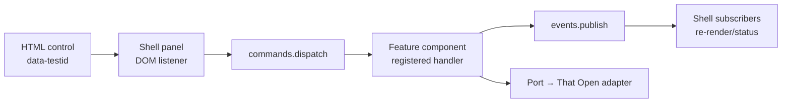
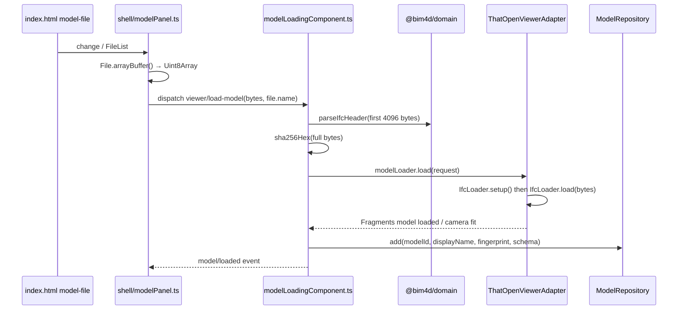
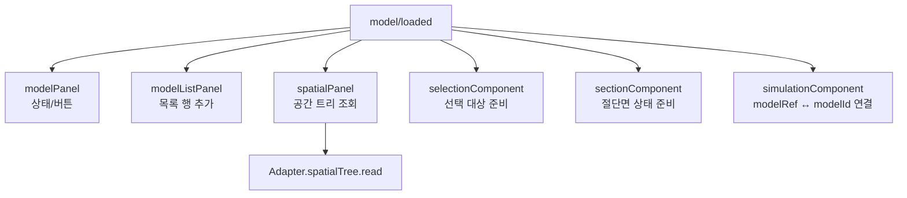
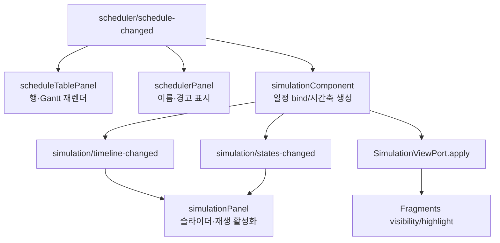

# BIM 4D Viewer 웹 코드 맵

> 기준: 2026-09-02 현재 `apps/viewer-web` 구현. 이 문서는 화면, 버튼, 스크롤, 파일 입출력, 코드 의존성과 호출 관계를 한곳에서 찾기 위한 지도다.

## 1. 전체 구조 이미지

```mermaid
flowchart TB
  Browser[Browser\nindex.html] --> Entry[main.ts\ncomposition root]
  Entry --> Kernel[Kernel\ncreateKernel + registry]
  Entry --> Shell[Shell UI components\nshell/*.ts]
  Entry --> Features[Feature components\nviewer/*, scheduler, simulation]
  Entry --> Adapter[That Open adapter\nthatOpenViewerAdapter.ts]
  Entry --> Repos[In-memory repositories]

  Shell -->|dispatch Command| Commands[Typed Command Dispatcher]
  Features -->|register handler| Commands
  Features -->|publish| Events[Typed Event Bus]
  Shell -->|subscribe| Events
  Features --> Ports[Port interfaces]
  Ports --> Adapter
  Features --> Repos
  Adapter --> ThatOpen[@thatopen/components\n@thatopen/fragments\nThree.js]
  Features --> Domain[@bim4d/domain\nparse · validate · simulation]
  Features --> Contracts[@bim4d/contracts\nCommand/Event/Port types]
```

핵심은 **Shell은 DOM만 다루고**, **Feature Component는 업무 규칙과 Command/Event를 다루며**, **That Open Adapter만 렌더러·IFC Loader·Three.js를 안다**는 분리다. 따라서 버튼이 직접 That Open API를 부르지 않는다.

## 2. 코드 트리

```text
apps/viewer-web/
├─ index.html                         화면 골격 + 전역 CSS + 모든 data-testid
├─ src/main.ts                        조립 지점(composition root), 등록 순서
├─ src/kernel/
│  ├─ createKernel.ts                 Event Bus + Command Dispatcher + Registry 생성
│  ├─ componentRegistry.ts            initialize/start, stop/dispose 수명주기
│  ├─ commandDispatcher.ts            Command 1개당 handler 1개를 보장
│  └─ eventBus.ts                     Event publish/subscribe
├─ src/shell/                         DOM 화면 조각: 입력·버튼·텍스트·목록만 담당
│  ├─ modelPanel.ts                   IFC 파일 선택, 현재 모델 제거, 상태 문구
│  ├─ modelListPanel.ts               여러 모델 목록, 모델별 표시/제거
│  ├─ spatialPanel.ts                 공간 트리 렌더링/선택
│  ├─ propertyPanel.ts                선택 객체 Attribute/Pset/Qto 표시
│  ├─ selectionPanel.ts               선택 GlobalId 상태 표시
│  ├─ visibilityPanel.ts              숨김/격리/전체 표시 버튼
│  ├─ sectionPanel.ts                 X/Y/Z 절단면, 표시, 제거 버튼
│  ├─ viewpointPanel.ts               시점 저장/복원, 화면 맞춤
│  ├─ schedulerPanel.ts               일정 JSON/CSV 업·다운로드, 경고 표시
│  ├─ scheduleTablePanel.ts           작업표·Gantt·행 편집·의존성 편집
│  ├─ scheduleRowEditing.ts           작업 행의 편집 입력과 행 액션 DOM 생성
│  ├─ simulationPanel.ts              재생/속도/시간 슬라이더
│  └─ statusComponent.ts              Kernel 상태 문구
├─ src/viewer/                        Viewer feature의 Command handler와 업무 상태
│  ├─ model/modelLoadingComponent.ts  IFC Header 검증, hash, load/unload orchestration
│  ├─ viewerWorldComponent.ts         canvas/world 생성·제거
│  ├─ selection/                      캔버스 picking과 선택 상태
│  ├─ visibility/                     선택 객체 숨김·격리 상태
│  ├─ spatial/                        공간 트리 Port 계약
│  ├─ property/                       속성 조회 Port 계약
│  ├─ camera/                         시점/fit Command handler
│  ├─ section/                        절단면 Command handler
│  └─ viewpoint/                      camera·section·visibility 조합 저장
├─ src/scheduler/                     일정 파싱/검증/편집/내보내기 업무 흐름
├─ src/simulation/                    일정→요소 표시 상태(4D) 계산·적용
├─ src/adapters/
│  ├─ thatopen/thatOpenViewerAdapter.ts  실제 IFC 로더/Fragments/Three.js 구현
│  ├─ inMemoryModelRepository.ts        모델 메타데이터 임시 저장
│  └─ inMemoryScheduleRepository.ts     일정 임시 저장
└─ src/shared/sha256.ts               원본 IFC fingerprint 계산

packages/
├─ contracts/src/                     앱 경계의 Command/Event/Port/DTO 타입
├─ domain/src/                         IFC Header, Schedule, 4D, Spatial Tree 순수 규칙
└─ test-fixtures/                      IFC 및 Schedule 시험 파일
```

## 3. 화면 구현과 스크롤 위치

`index.html`은 프레임과 CSS를 모두 보유한다. TypeScript Shell은 그 안의 `data-testid` 요소를 찾아 내용을 채우거나 이벤트 리스너를 단다. 별도의 React/Vue 컴포넌트나 CSS 파일은 없다.

| 화면 영역 | HTML/CSS 위치 | DOM 동작 구현 | 스크롤 방식 |
|---|---|---|---|
| 상단 헤더/IFC 도구 | `apps/viewer-web/index.html` (`header`) | `modelPanel.ts`, `visibilityPanel.ts`, `sectionPanel.ts` | 줄바꿈(`flex-wrap`), 자체 스크롤 없음 |
| 왼쪽 모델 목록 | `#models` | `modelListPanel.ts` | `max-height: 12rem; overflow: auto` |
| 왼쪽 공간 트리 | `#spatial-tree` | `spatialPanel.ts` | `overflow: auto` |
| 왼쪽 시점 목록 | `#viewpoints` | `viewpointPanel.ts` | `max-height: 14rem; overflow: auto` |
| 가운데 3D 캔버스 | `#viewer-container` | `viewerWorldComponent.ts` → That Open adapter | 컨테이너 `overflow: hidden`; 카메라 이동은 That Open controls |
| 오른쪽 속성 패널 | `#property-panel` | `propertyPanel.ts` | `overflow: auto` |
| 하단 작업표/Gantt | `#schedule-table`, `#schedule-table ol` | `scheduleTablePanel.ts`, `scheduleRowEditing.ts` | 바깥은 `overflow: hidden`; **작업 행 목록만** `max-height: 16rem; overflow-y: auto` |
| 하단 4D 재생 바 | `#simulation-bar` | `simulationPanel.ts` | 스크롤 없음 |

## 4. 화면 버튼·입력의 호출 관계



| 화면 제어 | Shell 시작 파일 | Command | 처리 Feature | 최종 효과 |
|---|---|---|---|---|
| `IFC 열기` file input | `shell/modelPanel.ts` | `viewer/load-model` | `viewer/model/modelLoadingComponent.ts` | Header 확인 → hash → That Open `IfcLoader.load` → 모델 등록/`model/loaded` |
| `모델 제거` | `shell/modelPanel.ts` | `viewer/unload-model` | `modelLoadingComponent.ts` | Adapter와 Repository에서 제거 → `model/unloaded` |
| 모델 목록 체크박스 | `shell/modelListPanel.ts` | `viewer/set-model-visible` | `viewer/visibility/visibilityComponent.ts` | Adapter가 해당 Fragments 모델의 visibility 변경 |
| 목록의 모델 제거 | `shell/modelListPanel.ts` | `viewer/unload-model` | `modelLoadingComponent.ts` | 위 모델 제거와 동일 |
| 3D 캔버스 클릭 | `viewer/selection/selectionComponent.ts` | `viewer/select-at` | 같은 파일 | Adapter picking → `selection/changed` → 속성/선택/가시성 UI 갱신 |
| 공간 트리 노드 | `shell/spatialPanel.ts` | `viewer/select-products` | `selectionComponent.ts` | ProductKey 선택 및 Highlight |
| `숨기기` / `격리` / `전체 표시` | `shell/visibilityPanel.ts` | `viewer/hide-selected`, `viewer/isolate-selected`, `viewer/show-all` | `visibilityComponent.ts` | Adapter Fragments visibility 변경 |
| X/Y/Z 절단면·토글·제거 | `shell/sectionPanel.ts` | `viewer/create-section`, `viewer/set-sections-enabled`, `viewer/clear-sections` | `sectionComponent.ts` | Adapter Clipper plane 생성/표시/삭제 |
| `시점 저장` / 시점 복원 / `화면 맞춤` | `shell/viewpointPanel.ts` | `viewer/save-viewpoint`, `viewer/restore-viewpoint`, `viewer/fit-camera` | `viewpointComponent.ts`, `cameraComponent.ts` | Adapter camera/section/visibility 값 적용 |
| 일정 JSON/CSV 선택 | `shell/schedulerPanel.ts` | `scheduler/load-schedule`, `scheduler/load-schedule-csv` | `schedulerComponent.ts` | domain parse/validate → repository 저장 → `scheduler/schedule-changed` |
| JSON/CSV 내보내기 | `shell/schedulerPanel.ts` | `scheduler/export-schedule` | `schedulerComponent.ts` | serialize 후 `<a download>`로 브라우저 저장 |
| `+ Task`, 셀 편집, 들여쓰기, 삭제, 선후행 | `shell/scheduleTablePanel.ts` + `scheduleRowEditing.ts` | `scheduler/edit-schedule` | `schedulerComponent.ts` | domain edit/재검증 → 새 작업표 이벤트 |
| 재생/일시정지, 속도, 시간 슬라이더 | `shell/simulationPanel.ts` | `simulation/play`, `pause`, `set-speed`, `set-time` | `simulationComponent.ts` | domain 4D 상태 계산 → Adapter visibility/highlight 적용 |

## 5. IFC 업로드: 파일이 실제로 읽히는 위치



1. 파일 선택 요소: [`index.html`](../apps/viewer-web/index.html)의 `data-testid="model-file"`. 허용 확장자는 `.ifc`, 여러 파일 선택이 가능하다.
2. 브라우저 파일 읽기: [`shell/modelPanel.ts`](../apps/viewer-web/src/shell/modelPanel.ts)의 `onFileChosen`. 각 `File`을 `arrayBuffer()`로 읽고 `Uint8Array`로 바꾼다. 원본 파일을 서버로 전송하거나 디스크에 쓰지 않는다.
3. 사전 검증 및 원본 식별: [`modelLoadingComponent.ts`](../apps/viewer-web/src/viewer/model/modelLoadingComponent.ts)는 앞 4096 byte만 디코드해 `parseIfcHeader`를 호출하고, 전체 바이트로 SHA-256 fingerprint를 만든다. Schema는 파일명 대신 Header `FILE_SCHEMA`에서 판별한다.
4. 실제 IFC 파싱/렌더링 로드: [`thatOpenViewerAdapter.ts`](../apps/viewer-web/src/adapters/thatopen/thatOpenViewerAdapter.ts)의 `ensureLoaderReady`와 `modelLoader.load`가 `OBC.IfcLoader.setup()` 후 `IfcLoader.load(request.bytes, ...)`를 호출한다. 결과는 That Open Fragments 모델이며, Adapter 내부의 `modelId → fragmentsModelId` map에 보관된다.
5. 메타데이터 저장: [`inMemoryModelRepository.ts`](../apps/viewer-web/src/adapters/inMemoryModelRepository.ts)는 `modelId`, 표시 이름, fingerprint, schema, loadedAt만 보관한다. 현재 저장소는 메모리 기반이므로 새로고침하면 사라진다.

IFC 원본은 읽기 전용이며, 이 웹 경로에는 IFC Export나 원본 덮어쓰기 구현이 없다. IFC 기준서의 `FILE_SCHEMA` 판별 원칙과 fingerprint 보존 원칙을 따르는 부분이다. Web rendering 산출물은 ADR-0001의 Fragments이며, Python `services/ifc-worker`는 이 브라우저 형상 로딩 경로에 포함되지 않는다.

## 6. 일정 파일 업로드·내보내기

| 형식 | 입력 UI / 읽기 코드 | 파싱·검증 | 저장 | 출력 |
|---|---|---|---|---|
| JSON | `schedule-file` → `schedulerPanel.ts`: `File.text()` + `JSON.parse` | `domain/parseSchedule` | `inMemoryScheduleRepository.ts` | `serializeScheduleJson` → `schedule.json` 다운로드 |
| CSV 묶음 | 같은 입력. `schedulerPanel.ts`: `File.text()` | `domain/parseScheduleCsv` | 같은 저장소 | `serializeScheduleCsv` → 3~4개 CSV 다운로드 |

CSV는 `schedule.csv`, `tasks.csv`, `assignments.csv`가 필수이며 `dependencies.csv`는 선택이다. `schedulerPanel.ts`의 `toCsvBundle`이 파일명을 역할로 분류하고, `schedulerComponent.ts`가 의미 검증을 한 지점에서 수행한다. 모르는 CSV 파일명, 중복 역할, 필수 파일 누락은 로딩 실패로 처리된다.

## 7. Feature별 의존성

```mermaid
graph TD
  Main[main.ts] --> K[kernel]
  Main --> SH[shell/*]
  Main --> VM[viewer/model]
  Main --> VV[viewer/selection · visibility · section · camera · viewpoint]
  Main --> SC[scheduler]
  Main --> SI[simulation]
  Main --> AO[adapters/thatopen]

  SH --> C[@bim4d/contracts]
  VM --> C
  VM --> DM[@bim4d/domain: ifcHeader]
  VM --> AO
  VM --> MR[inMemoryModelRepository]
  VV --> C
  VV --> AO
  SC --> C
  SC --> DS[@bim4d/domain: schedule]
  SC --> SR[inMemoryScheduleRepository]
  SI --> C
  SI --> DS
  SI --> AO
  AO --> TO[That Open + Fragments + Three]
```

| 계층 | 직접 의존하는 것 | 금지/회피하는 것 |
|---|---|---|
| `shell/*` | `@bim4d/contracts`, feature의 event 선언 side-effect import, DOM API | That Open, Three.js, repository, domain의 구체 상태 |
| `viewer/*`, `scheduler`, `simulation` | contracts, domain, Port interface, 주입된 repository | DOM/That Open의 구체 구현을 직접 import |
| `adapters/thatopen` | `@thatopen/components`, `@thatopen/fragments`, `three`, viewer Port | Shell/DOM |
| `packages/domain` | contracts 타입과 순수 TypeScript 규칙 | DOM, That Open, WebView, IfcOpenShell |
| `packages/contracts` | 타입 선언만 | 구현·프레임워크 |

## 8. Command와 Event의 역할

`main.ts`가 모든 Component를 등록한다. Kernel은 등록 순서대로 `initialize → start`하고 종료 시 역순으로 `stop → dispose`한다. 이 순서 때문에 World가 Model보다 먼저 만들어지고, 종료 시에는 Model이 먼저 해제되어 GPU/worker 누수를 줄인다.

| 구분 | 흐름 | 사용 목적 |
|---|---|---|
| Command | Shell → `commands.dispatch(name, input)` → Feature handler 1개 | 사용자의 의도를 한 곳에서 실행. 예: `viewer/load-model` |
| Event | Feature → `events.publish(name, payload)` → 구독 Shell/Feature 여러 개 | 완료된 사실을 여러 UI가 함께 반영. 예: `model/loaded`, `scheduler/schedule-changed` |
| Port | Feature → 주입된 인터페이스 → Adapter | 외부 기술을 교체 가능하게 격리. 예: `ModelLoaderPort` |
| Repository | Feature → Port → in-memory adapter | 모델/일정 상태를 렌더러와 분리 |

Command dispatcher는 같은 Command handler의 중복 등록을 막고, handler 오류를 호출자에게 `CommandResult`로 돌려준다. Event bus는 구독자 하나가 실패해도 다른 구독자는 계속 호출한다. Event payload에는 IFC bytes, mesh, fragment를 싣지 않고 식별자와 요약 정보만 보낸다.

## 9. 대표 호출 관계 세부

### 모델 로드 이후 파급



### 일정 변경 이후 4D 파급



## 10. 빠른 찾기

| 찾고 싶은 것 | 첫 파일 | 다음 파일 |
|---|---|---|
| 버튼이 왜 안 눌리는가 | `index.html`의 `data-testid` | `main.ts` selector 주입 → 해당 `shell/*Panel.ts` listener |
| Command가 누가 처리하는가 | `packages/contracts/src/commands.ts`의 이름 | 해당 feature의 `commands.register(...)` |
| 이벤트를 누가 받는가 | feature의 `events.publish(...)` | `rg "subscribe\('이벤트명'" apps/viewer-web/src` |
| IFC가 어디서 파싱되는가 | `modelPanel.ts` | `modelLoadingComponent.ts` → `thatOpenViewerAdapter.ts` |
| 파일 정보를 어디에 저장하는가 | `modelLoadingComponent.ts` | `inMemoryModelRepository.ts` |
| 일정 CSV 규칙 | `schedulerPanel.ts` | `schedulerComponent.ts` → `packages/domain/src/scheduleCsv.ts` → ADR-0007 |
| 스크롤바 CSS | `index.html` | `#models`, `#spatial-tree`, `#viewpoints`, `#property-panel`, `#schedule-table ol` |

## 11. 현재 구현 경계

- 브라우저 앱의 IFC 파일은 메모리에서만 읽는다. 백엔드 업로드, 영구 프로젝트 저장, SQLite는 아직 연결되지 않았다.
- 원본 IFC를 저장·변환·내보내는 구현은 이 UI 경로에 없다.
- `.frag` 캐시 메타데이터와 원본 fingerprint의 불일치 재변환은 전체 아키텍처 목표에는 있으나, 현재 web viewer 코드에서는 `IfcLoader.load`의 런타임 로드 경로만 보인다.
- 화면 시각 검증은 `tests/e2e/scheduleLayout.spec.ts`가 작업표의 배치 계약을 담당한다. 모델 로딩과 기능 흐름은 `tests/e2e/modelLoading.spec.ts`, `scheduler.spec.ts`, `simulation.spec.ts` 등으로 확인한다.
